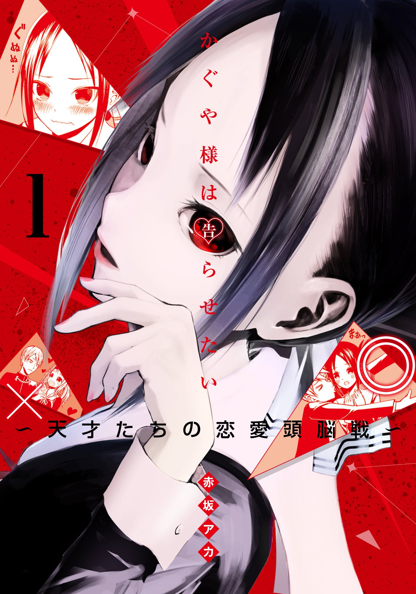

> _**A romantic battle of the wits. It's a duel between two souls, with their dignity on the line!**_

## Episode 1 thoughts

Well, that was a surprise. I only dived into this thanks to the first episode's r/anime thread getting gilded a whopping 30xSilvers, 20xGolds and 10xPlatinums. How could i not wonder what made people donate so furiously at the sub's autobot? Turns out, it's not _that_ impressive, but it's still decent! It takes the "good old" (i hate it with a passion) tropes of being afraid to confess to one's significant other and turns the tropes on their head, parodies them and turns the whole thing into a ridiculous game of getting the other one confess first. So both MCs want to be confessed to each other and want to avoid confessing themselves and that leads them to conjure up evermore ridiculous schemes and strategies to get the "opponent" confess. And it works quite nicely, but not to it's complete potential if I'm honest. They portray the MCs as being one of _the smartest people_ at their age group, so i expected to get something akin to Jojo where they outplay each other with increasingly complex and stupid schemes. "I got you now, prepare to lose!" "But, i expected you to do this all along... See, there's a knife with a reverse blade in my coat pocket that my grandfather gifted to me years ago and knowing you would strike with your left leg - thanks to seeing you limp once a week ago- i moved to the correct position! It's over, i win!" "You would think so, but i foresaw this! The way you tied your shoes on your birthday 3 years ago, gave away that you carried that knife, as such i had prepared for it. I knew that you would counter my move, so it's MY victory!" A battle of the wits to the max! But instead, it's surprisingly tame so far. But i guess they can't go all out from the get-go and even then, it's pretty funny. I rarely laugh out loud at comedies - being the cold hearted estonian male that I'm suppose to be haha - but Kaguya-sama managed it. Furthermore, i read that ex-SHAFT is working on this, and it shows! I thought the pacing and visual trickery-doo was familiar - it all makes sense now! So all in all i guess it managed to impress me, and knowing old SHAFT bois are on this gives me hope.
